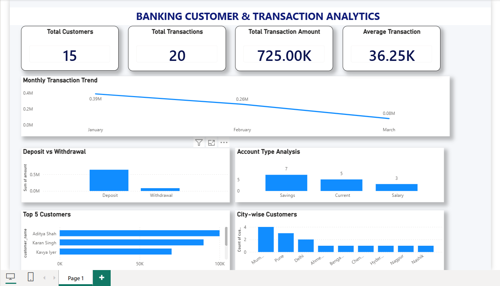

# 🏦 Banking Customer & Transaction Analytics

## 📊 Project Overview

Banking Customer & Transaction Analytics is a data analytics project built using **MySQL and Power BI**.

The project analyzes customer and transaction data to understand transaction trends, customer behavior, account types, city-wise customer distribution, and high-value customers.

---

## 🛠️ Tools & Technologies

- MySQL
- SQL
- Power BI
- Data Visualization
- Dashboard Design

---

## 🗄️ Database

### Database Name
`banking_analytics`

### Tables

#### Customers
- customer_id
- customer_name
- age
- gender
- city
- account_type

#### Transactions
- transaction_id
- customer_id
- transaction_date
- transaction_type
- amount
- balance

---

## 🔍 SQL Analysis

The following SQL concepts were used:

- SELECT
- WHERE
- GROUP BY
- ORDER BY
- COUNT()
- SUM()
- AVG()
- INNER JOIN
- MONTH()
- LIMIT
- Aggregate Functions

### Key SQL Analyses

- Transaction Type Analysis
- Deposit vs Withdrawal Analysis
- Monthly Transaction Analysis
- Customer & Transaction JOIN
- Top 5 Customers by Transaction Amount
- City-wise Customer Analysis
- Account Type Analysis
- Overall KPI calculations

---

## 📈 Power BI Dashboard

The interactive dashboard contains the following KPIs and visualizations:

### KPI Cards

- 👥 Total Customers: **15**
- 🔄 Total Transactions: **20**
- 💰 Total Transaction Amount: **725K**
- 📊 Average Transaction: **36.25K**

### Visualizations

- 📈 Monthly Transaction Trend
- 💳 Deposit vs Withdrawal
- 🏦 Account Type Analysis
- 🏆 Top 5 Customers
- 📍 City-wise Customers

---

## 📸 Dashboard Preview

---

## 💡 Key Insights

- The dataset contains **15 customers** and **20 transactions**.
- Total transaction amount analyzed is **725K**.
- Average transaction amount is approximately **36.25K**.
- Deposit transactions contribute significantly more to the total transaction amount than withdrawals.
- Customer distribution varies across different cities.
- Savings, Current, and Salary accounts were analyzed to compare customer distribution.
- Top customers were identified based on their total transaction amount.
- Monthly transaction trends were analyzed for January, February, and March.

---

## 🎯 Project Objective

The main objective of this project is to demonstrate how **SQL and Power BI** can be used together to transform raw banking data into meaningful business insights and an interactive analytics dashboard.

---

## 👩‍💻 Author

**Nikita Jadhav**

GitHub: [NikitaJadhav19](https://github.com/NikitaJadhav19)
